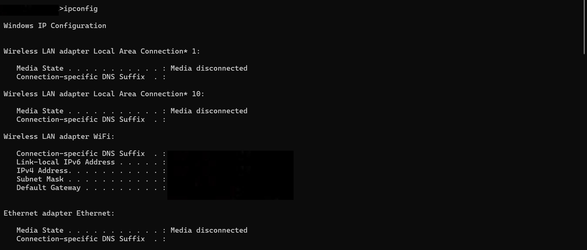
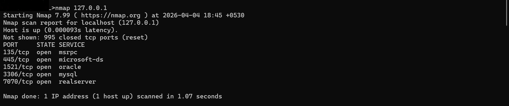
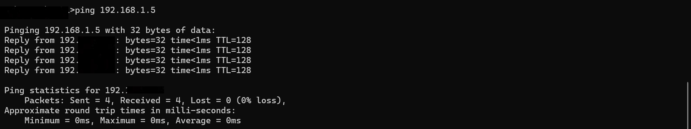
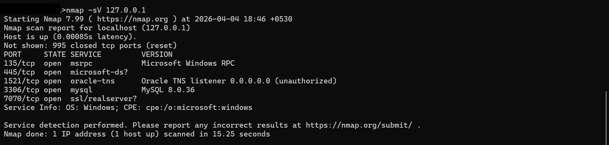
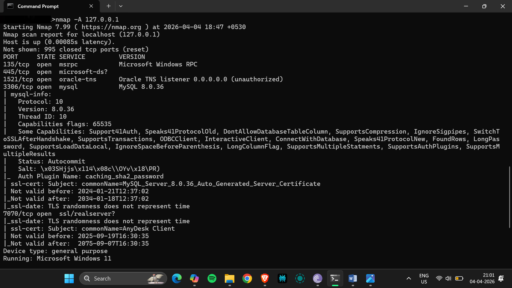
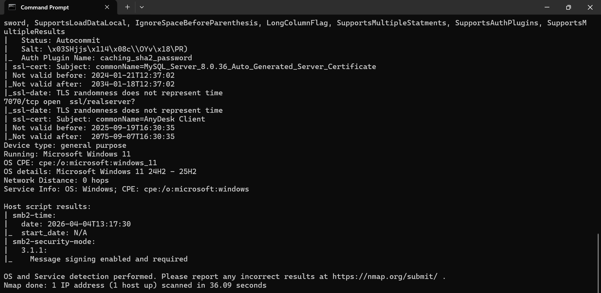
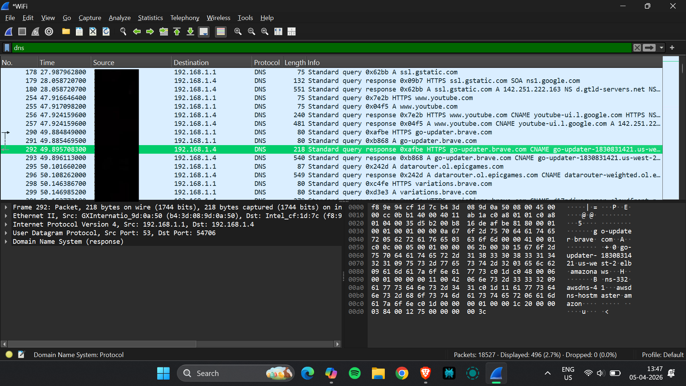
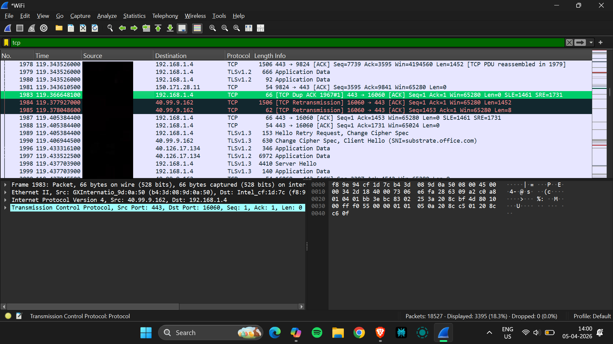
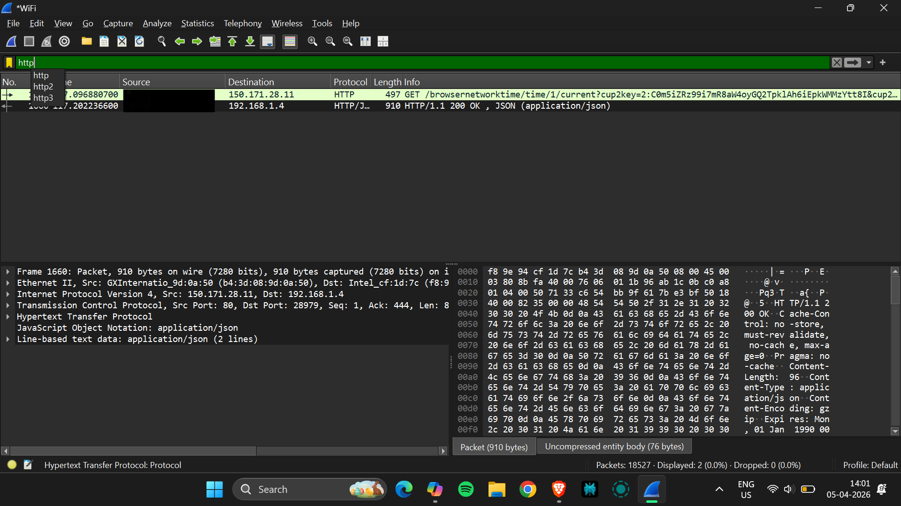
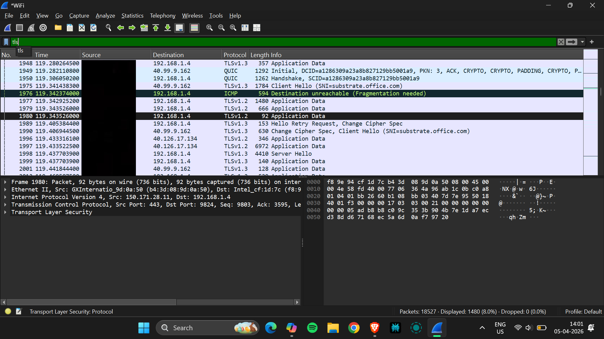

# Network Reconnaissance and Traffic Analysis Lab

## Overview
This project demonstrates network security analysis by combining reconnaissance and traffic analysis using Nmap and Wireshark. It focuses on identifying exposed services and analyzing real-time network communication to understand potential security risks.

---

## Tools Used
- Nmap – Network scanning and service detection  
- Wireshark – Packet capture and protocol analysis  

---

## Objectives
- Identify open ports and active services  
- Detect service versions and system details  
- Capture and analyze real-time network traffic  
- Understand communication protocols such as DNS, TCP, HTTP, and TLS  
- Correlate scanning results with actual network activity  

---

## Methodology

### Nmap Scanning

Basic Scan:
nmap <target-ip>

Service Version Detection:

nmap -sV <target-ip>

Aggressive Scan:

nmap -A <target-ip>

---

### Wireshark Analysis
- Captured live traffic using an active network interface  
- Generated traffic through browsing and network commands  
- Applied protocol filters including:
  - DNS  
  - TCP  
  - HTTP  
  - TLS  

---

## Key Findings

### Open Ports Identified
- 135 (MSRPC)  
- 445 (SMB)  
- 1521 (Oracle Database)  
- 3306 (MySQL)  
- 7070 (Remote Access Service)  

---

### Traffic Analysis Insights
- DNS queries reveal domain name resolution  
- TCP handshake (SYN → SYN-ACK → ACK) ensures reliable communication  
- HTTP traffic is unencrypted and insecure  
- TLS provides encrypted and secure communication  

---

## Integrated Analysis
Nmap was used to identify open ports and exposed services, while Wireshark was used to analyze real-time communication.

This combined approach demonstrates:
- Nmap identifies what is exposed  
- Wireshark shows how it is used  

Together, they provide a comprehensive understanding of network behavior and security risks.

---

## Security Risks
- SMB (Port 445) is vulnerable to network-based attacks  
- Database services may be exposed to unauthorized access  
- Remote access services may allow unauthorized control  
- Unencrypted traffic (HTTP, DNS) exposes sensitive information  

---

## Report
The complete detailed report is available in this repository.

---

## Skills Gained
- Network reconnaissance  
- Packet analysis  
- Security assessment  

---

[View Full Report](./Network_Recon_Traffic_Analysis_Report.pdf)

---

## Screenshots

### System Information

---

### Nmap Scans
  
  
  
  
  

---

### Wireshark Analysis
  
  
  

